 

[site](https://www.devinlines.com.br/) · [linkedin](https://www.linkedin.com/in/saulo-gabriel-55b080306/) · [steam](https://steamcommunity.com/id/khastz95/) · [email](mailto:saulo1337@proton.me)

<table>
<tr>
<td width="50%">

**[WaterCats](https://github.com/khastz95/watercats)**  
Site do clube e bot de partidas.

</td>
<td width="50%">

**[backup-fdb-client](https://github.com/khastz95/backup-fdb-client)**  
Backup Firebird, FTP e painel de representantes.

</td>
</tr>
<tr>
<td width="50%">

**[ELOJOBCS2](https://github.com/khastz95/ELOJOBCS2)**  
Site de [elojobcs2.com.br](https://www.elojobcs2.com.br).

</td>
<td width="50%">

**[camp-x1](https://github.com/khastz95/camp-x1)**  
Campeonato de X1.

</td>
</tr>
</table>
