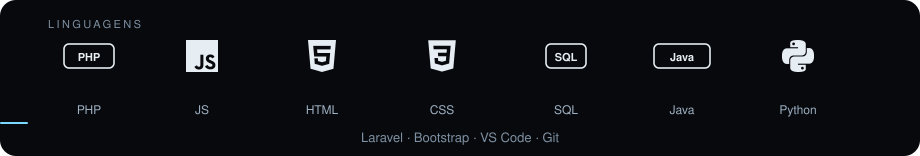

 

Desenvolvedor na **Alfa Automação Comercial**, em Guarapuava/PR. Sites, integrações e ferramentas que entram em operação.

[site](https://www.devinlines.com.br/) · [linkedin](https://www.linkedin.com/in/saulo-gabriel-55b080306/) · [steam](https://steamcommunity.com/id/khastz95/) · [email](mailto:saulo1337@proton.me)

 

### Projetos

[WaterCats](https://github.com/khastz95/watercats) — site do clube e bot de partidas

[backup-fdb-client](https://github.com/khastz95/backup-fdb-client) — backup Firebird, FTP e painel de representantes

[ELOJOBCS2](https://github.com/khastz95/ELOJOBCS2) — site de [elojobcs2.com.br](https://www.elojobcs2.com.br)

[camp-x1](https://github.com/khastz95/camp-x1) — campeonato de X1
