Desenvolvedor na **Alfa Automação Comercial**, em Guarapuava/PR. Sites, integrações e ferramentas para o dia a dia.

[site](https://www.devinlines.com.br/) · [linkedin](https://www.linkedin.com/in/saulo-gabriel-55b080306/) · [steam](https://steamcommunity.com/id/khastz95/) · [email](mailto:saulo1337@proton.me)

### Projetos

<table align="center">
<tr>
<td width="50%">

[WaterCats](https://github.com/khastz95/watercats) site do clube e bot de partidas

</td>
<td width="50%">

[backup-fdb-client](https://github.com/khastz95/backup-fdb-client) backup Firebird, FTP e painel de representantes

</td>
</tr>
<tr>
<td>

[ELOJOBCS2](https://github.com/khastz95/ELOJOBCS2) site de [elojobcs2.com.br](https://www.elojobcs2.com.br)

</td>
<td>

[camp-x1](https://github.com/khastz95/camp-x1) campeonato de X1

</td>
</tr>
</table>

